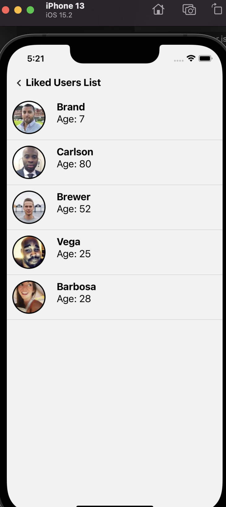
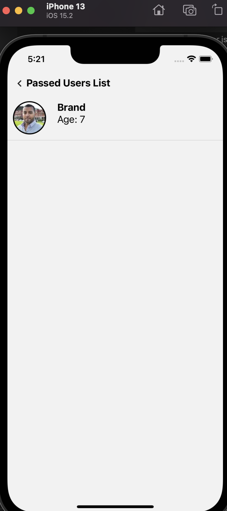

# React Native Animation Demo

This project is a [React Native](https://facebook.github.io/react-native/)

## Requirements

Node 14 or greater is required. Development for iOS requires a Mac and Xcode 11 or up, and will target iOS 11 and up.

You also need to install the dependencies required by React Native.
Go to the [React Native environment setup](https://reactnative.dev/docs/environment-setup), then select `React Native CLI Quickstart` tab.
Follow instructions for your given `development OS` and `target OS`.

## Quick start
Assuming you have all the requirements installed, you can run the project by running:

- `yarn start` to start the metro bundler, in a dedicated terminal
- `yarn <platform>` to run the *platform* application (remember to start a simulator or connect a device)

## Screenshot

## Library
- [Animation](https://github.com/oblador/react-native-animatable)
- [Icon](https://reactnativeelements.com/)